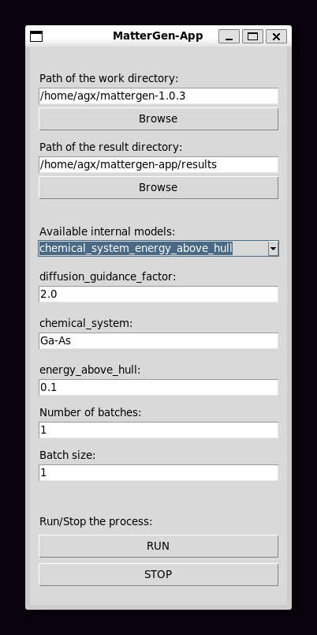

# MatterGen-App

MatterGen-App is a Tkinter-based interface for running MatterGen tasks, developed as a study project at Munich University of Applied Sciences to implement input configuration, execution control, and result display.

## Table of Contents

- [MatterGen-App](#mattergen-app)
  - [Table of Contents](#table-of-contents)
  - [Install on Windows with WSL (recommended)](#install-on-windows-with-wsl-recommended)
    - [WSL setup](#wsl-setup)
    - [Setup VSCode on WSL (Debian)](#setup-vscode-on-wsl-debian)
    - [Setup Git on WSL (Debian)](#setup-git-on-wsl-debian)
    - [Install required pre-packages (Debian)](#install-required-pre-packages-debian)
    - [Install MatterGen (Debian)](#install-mattergen-debian)
  - [Install on Windows (experimental)](#install-on-windows-experimental)

## Install on Windows with WSL (recommended)

Certain preparations must be made when installing on Windows compared to Linux.
You need WSL (Windows Subsystem for Linux) in order to run properly. Please refer to this [link](https://learn.microsoft.com/en-us/windows/wsl/install).

### WSL setup

You can install WSL using:  
``wsl --install``

After rebooting the system list the available distros you can choose from:  
``wsl --list --online``

Install a preferred Linux distro (e.g. Debian):  
``wsl --install Debian``

After installing start WSL using:  
``wsl -d Debian``

### Setup VSCode on WSL (Debian)

Install [VSCode](https://code.visualstudio.com/) and the [Remote Development](https://marketplace.visualstudio.com/items?itemName=ms-vscode-remote.vscode-remote-extensionpack) extension.

On WSL update the distro using and install ``wget`` and ``ca-certificates``:  
``sudo apt-get update``  
``sudo apt-get install wget ca-certificates``

Run ``. code`` to open a session in VSCode.

_Info: You can access the entire filesystem of your distro in VSCode from Windows without the need of a command line using this approach._

Refer to this [link](https://learn.microsoft.com/en-us/windows/wsl/tutorials/wsl-vscode) for more details about how to create a setup with VSCode on WSL.

### Setup Git on WSL (Debian)

On WSL install ``git`` using:  
``sudo apt-get install git``

Setup ``git``:  
``git config --global user.name "Your Name"``  
``git config --global user.email "youremail@domain.com"``

In the command palette in VSCode which can be accessed using ``Ctrl+Shift+P`` clone the git repository
using the command ``Git: Clone`` and provide following URL:  
``https://github.com/kerimyalcin95/mattergen-app.git``

### Install required pre-packages (Debian)

Install the newest version of ``Python`` environment:  
``sudo apt-get install python3 python3-tk pip``

### Install MatterGen (Debian)

Download ``MatterGen`` version 1.0.3:  
``wget https://github.com/microsoft/mattergen/archive/refs/tags/v1.0.3.zip``

Unzip the file:  
``unzip v1.0.3.zip``

Install ``uv`` package manager:  
``curl -Ls https://astral.sh/uv/install.sh -o install.sh``  
``sh install.sh``  
``echo 'export PATH="$HOME/.local/bin:$PATH"' >> ~/.bashrc``  
``source ~/.bashrc``  

Inside the ``mattergen-1.0.3`` folder create a virtual Python 3.10 environment
to install ``MatterGen``:  
``uv venv .venv --python 3.10``  
``source .venv/bin/activate``  
``uv pip install -e .``  

You have to install an older version of ``setuptools``, otherwise execution fails:  
``uv pip install --force-reinstall --no-cache-dir setuptools==75.8.0``

## Install on Windows (experimental)

Download and install [C++ Build tools](https://aka.ms/vs/stable/vs_BuildTools.exe) and select _Desktop development with C++_.

Inside following must be selected:

- MSVC v143 (or latest)
- Windows 10/11 SDK
- C++ CMake tools for Windows
- MSBuild
- Clang tools

Download MatterGen v1.0.3 [source code](https://github.com/microsoft/mattergen/archive/refs/tags/v1.0.3.zip) and extract it.

Install ``uv`` package manager:

``pip install uv``

Inside the repository create an environment for Python 3.10:

``uv venv .venv --python 3.10``

Activate the environment:

``.\.venv\Scripts\activate``

Pre-Packages must be installed before installing ``mattergen``:

``uv pip install torch numpy cython mattersim=1.1.2``

Install ``mattergen``:

``uv pip install -e . --no-build-isolation``

Create a folder named ``tmp`` in ``C:\``

_Info: ``MatterGen`` is developed to run on Linux, so a ``tmp`` folder is required, otherwise it fails when saving the generated ``.cif`` files to disk. This folder location cannot be changed with ``Hydra`` configuration files, as the path is hardcoded._

_Info: It is not recommended using this approach because ``MatterGen`` paths are only optimized for Linux
distros. Please setup in Linux directly or via virtualization on Windows using WSL (Windows Subsystem for Linux)_
