# MatterGen-App

MatterGen-App is a Tkinter-based interface for running MatterGen tasks, developed as a study project at Munich University of Applied Sciences to implement input configuration, execution control, and result display.


## Table of Contents

- [MatterGen-App](#mattergen-app)
  - [Table of Contents](#table-of-contents)
  - [Installation](#installation)
    - [Install on Linux (Debian)](#install-on-linux-debian)
      - [Install required pre-packages (Debian)](#install-required-pre-packages-debian)
      - [Install MatterGen (Debian)](#install-mattergen-debian)
    - [Install on Windows with WSL](#install-on-windows-with-wsl)
      - [WSL setup](#wsl-setup)
      - [VSCode Setup (Debian)](#vscode-setup-debian)
      - [Git Setup (Debian)](#git-setup-debian)
      - [Further Setup](#further-setup)
    - [Install on Windows (experimental)](#install-on-windows-experimental)
  - [Technical Details about MatterGen](#technical-details-about-mattergen)
  - [Manual](#manual)
    - [Path of the work directory](#path-of-the-work-directory)
    - [Path of the result directory](#path-of-the-result-directory)
    - [Available internal models](#available-internal-models)
    - [Model conditions](#model-conditions)
      - [diffusion\_guidance\_factor](#diffusion_guidance_factor)
      - [chemical\_system](#chemical_system)
      - [space\_group](#space_group)
      - [dft\_mag\_density](#dft_mag_density)
      - [dft\_band\_gap](#dft_band_gap)
      - [ml\_bulk\_modulus](#ml_bulk_modulus)
      - [dft\_mag\_density\_hhi\_score](#dft_mag_density_hhi_score)
      - [chemical\_system\_energy\_above\_hull](#chemical_system_energy_above_hull)
    - [Batch parameters](#batch-parameters)
    - [Process Run and Stop](#process-run-and-stop)
  - [License](#license)

## Installation

### Install on Linux (Debian)

#### Install required pre-packages (Debian)

Install the newest version of `Python` environment:

```bash
sudo apt-get install python3 python3-tk pip
```

#### Install MatterGen (Debian)

Download `MatterGen` version 1.0.3:

```bash
wget https://github.com/microsoft/mattergen/archive/refs/tags/v1.0.3.zip
```

Unzip the file:

```bash
unzip v1.0.3.zip
```

Install `uv` package manager:

```bash
curl -Ls https://astral.sh/uv/install.sh -o install.sh
sh install.sh
echo 'export PATH="$HOME/.local/bin:$PATH"' >> ~/.bashrc
source ~/.bashrc
```

Inside the `mattergen-1.0.3` folder create a virtual Python 3.10 environment
to install `MatterGen`:

```bash
uv venv .venv --python 3.10
source .venv/bin/activate
uv pip install -e .
```

You have to install an older version of `setuptools`, otherwise execution fails:

```bash
uv pip install --force-reinstall --no-cache-dir setuptools==75.8.0
```

### Install on Windows with WSL

Certain preparations must be made when installing on Windows compared to Linux.
You need WSL (Windows Subsystem for Linux) in order to run properly. Please refer to the [Windows Subsystem for Linux installation guide](https://learn.microsoft.com/en-us/windows/wsl/install) for more information.

#### WSL setup

You can install WSL using:

```bash
wsl --install
```

After rebooting the system list the available distros you can choose from:

```bash
wsl --list --online
```

Install a preferred Linux distro (e.g. Debian):

```bash
wsl --install Debian
```

After installing start WSL using:

```bash
wsl -d Debian
```

#### VSCode Setup (Debian)

Install [VSCode](https://code.visualstudio.com/) and the [Remote Development](https://marketplace.visualstudio.com/items?itemName=ms-vscode-remote.vscode-remote-extensionpack) extension.

On WSL update the distro using and install `wget` and `ca-certificates`:

```bash
sudo apt-get update
sudo apt-get install wget ca-certificates
```

Run `. code` to open a session in VSCode.

_Info: You can access the entire filesystem of your distro in VSCode from Windows without the need of a command line using this approach._

Refer to the [Microsoft Windows Subsystem Setup Documentation](https://learn.microsoft.com/en-us/windows/wsl/tutorials/wsl-vscode) for more details.

#### Git Setup (Debian)

On WSL install `git` using:

```bash
sudo apt-get install git
```

Configure user name and email address in `git`:

```bash
git config --global user.name "Your Name"
git config --global user.email "youremail@domain.com"
```

In the command palette in VSCode which can be accessed using `Ctrl+Shift+P` clone the git repository
using the command `Git: Clone` and provide following URL:

```bash
https://github.com/kerimyalcin95/mattergen-app.git
```

#### Further Setup

After initial setup the corresponding packages have to be installed. Please refer to the section [Install on Linux (Debian)](#install-on-linux-debian) for further setup.

### Install on Windows (experimental)

_Warning: `MatterGen-App` does not run on Windows natively. The code that is designed to run on Linux has to be ported into the `app_windows.py` file._

Download and install [C++ Build tools](https://aka.ms/vs/stable/vs_BuildTools.exe) and select _Desktop development with C++_.

Inside following must be selected:

- MSVC v143 (or latest)
- Windows 10/11 SDK
- C++ CMake tools for Windows
- MSBuild
- Clang tools

Download MatterGen v1.0.3 [source code](https://github.com/microsoft/mattergen/archive/refs/tags/v1.0.3.zip) and extract it.

Install `uv` package manager:

```bash
pip install uv
```

Inside the repository create an environment for Python 3.10:

```bash
uv venv .venv --python 3.10
```

Activate the environment:

```bash
.\.venv\Scripts\activate
```

Pre-Packages must be installed before installing `mattergen`:

```bash
uv pip install torch numpy cython mattersim=1.1.2
```

Install `mattergen`:

```bash
uv pip install -e . --no-build-isolation
```

Create a folder named `tmp` in `C:\`

```powershell
New-Item -Path "C:\tmp" -ItemType Directory
```

_Info: `MatterGen` is developed to run on Linux, so a `tmp` folder is required, otherwise it fails when saving the generated `.cif` files to disk. This folder location cannot be changed with `Hydra` configuration files, as the path is hardcoded._

_Info: It is not recommended using this approach because `MatterGen` paths are only optimized for Linux
distros. Please setup in Linux directly or via virtualization on Windows using WSL (Windows Subsystem for Linux)._

## Technical Details about MatterGen

## Manual  

The `MatterGen` app saves configuration, size and position of the app automatically without the intervention
of the user. Reopening the app restores configuration. After configuring the app and starting a process the app
the commands are run using the system CLI (_command line interface_). An internet connection is required to 
download the models from `huggingface`.

_Warning: The app has to be started inside a terminal otherwise execution of the app will fail._

### Path of the work directory

Provide a path where of the `mattergen-1.0.3` repository locally installed on your system.
If the dialog is cancelled the text field will be replaced by the directory `\tmp`.

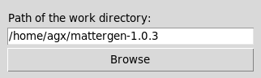

### Path of the result directory

Provide a path where the results have to be generated.

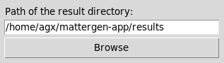

`MatterGen` will generate three files

- `generated_crystals.extxyz`  
  contains generated structures in ``EXTXYZ``-format, a normal XYZ file which includes physics data like
  atomic positions, element types, cell parameters, energies, forces, and other properties.
- `generated_crystals_cif.zip`  
  contains (multiple) crystal structures stored in ``CIF``-format, which may be used for visualization
  and crystallographic data exchange
- `generated_trajectories.zip`  
  contains step-by-step atomic evolution data of generated crystal structures, recording intermediate configurations, energies, and forces during the ``MatterGen`` sampling or relaxation process

If the dialog is cancelled the text field will be replaced by `{work-path}\results`.
For example: The work path is `/home/agx/mattergen` and cancelling the dialog will change the text field into `/home/agx/mattergen/results`.

_Warning: Results should in the work directory. Misconfiguration may corrupt the repository files._

### Available internal models

`MatterGen` offers two unconditioned models and seven fine-tuned models to choose from.

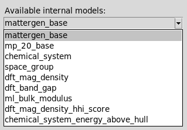

### Model conditions

`mattergen_base` and `mp_base` are unconditioned models, which generate crystal structures randomly.

More about the condition parameters can be found in the [Documentation of the Materials Project](https://docs.materialsproject.org/methodology/materials-methodology).

More about the model configuration can be found in the corresponding model configuration files in the [Huggingface repository](https://huggingface.co/microsoft/mattergen/tree/main/checkpoints).

_Info: Part of this section uses descriptions generated by a LLM._
_Warning: Some values provided are from experience. Reference values are not available in the official MatterGen repository documentation._

#### diffusion_guidance_factor

The `diffusion_guidance_factor` controls how strongly the generation process is steered toward a desired target during the diffusion steps.

In diffusion-based crystal generation, the model starts from noise and gradually refines atomic positions.

Diffusion guidance is an extra “force” applied during sampling that pushes the structure toward specific constraints (like composition, stability, or property targets).

Typical values:  
`0.0 - 1.0` (weak)  
`1.0 - 3.0` (normal)  
`>3.0` (strong)  

#### chemical_system

Fine-tune model conditioned on the chemical system.  

Examples:  
`Al-Ga-As`  
`Fe-O`  
`Rh-Be-B-N-Si-Au`  

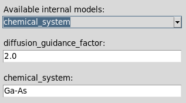

#### space_group

Fine-tuned model conditioned on the space group.  

Typical values:  
`1 - 230`

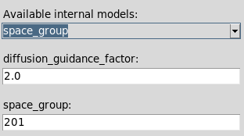

#### dft_mag_density

Fine-tuned model conditioned on magnetic density from DFT.  

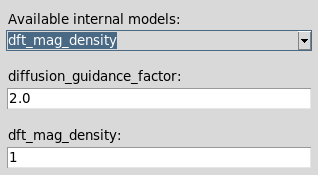

#### dft_band_gap

Fine-tuned model conditioned on band gap from DFT.  

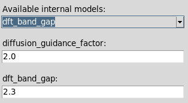

#### ml_bulk_modulus

Fine-tuned model conditioned on bulk modulus from ML predictor.  

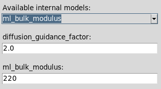

#### dft_mag_density_hhi_score

Fine-tuned model jointly conditioned on magnetic density from DFT and HHI score.  

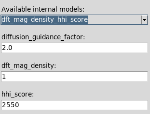

#### chemical_system_energy_above_hull

Fine-tuned model jointly conditioned on chemical system and energy above hull from DFT.  

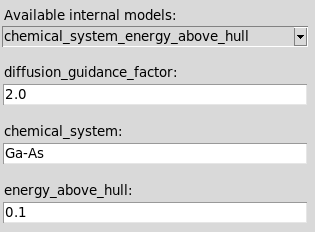

### Batch parameters

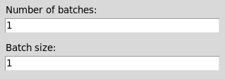

### Process Run and Stop

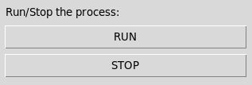

_Warning: Closing the app or pressing [STOP] button cancels the process immediately. Data may be lost._  
_Info: Generated crystal structure files may be found in the `\tmp` folder._

## License  

This project is licensed under the [MIT License](LICENSE).
